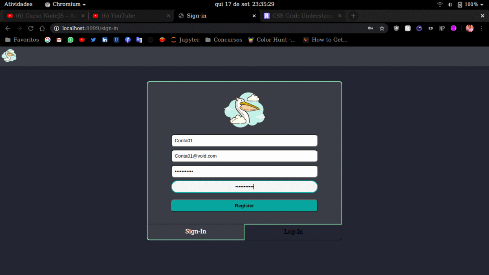

 

# Simple Login System

Como Atividade de NodeJs e MongoDB para a cadeira de Desenvolvimento de Softwares para Web fiz esse sistema de Login simples. Não tem nenhum método de autentificação somente o uso de Nodejs e MongoDb básico.

## Info

Estava interessado em fazer um sistema de login, por isso fiz usando paginas html.

- Tem as seguintes rotas:

get 	"/" ou "/sign-in" 	: rota de cadastro de usuário  
get 	"/log-in" 		: rota de login de usuário
post 	"/register"		: rota de cadastro de usuário no banco
post	"/login"			: rota de verificão de usuário valido
get		"/api/users"		: json com os usuários cadastrados

- Usei o MongoDB Compass para analizar  o banco e aprendi uma forma de instalar usando o docker
- Usei o Insomnia para ver as rotas

// acabei não usando o 'SalvarLogin' pedido